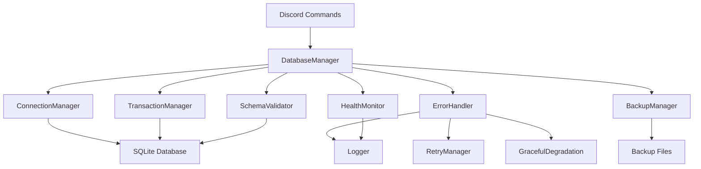

# Design Document: Database Reliability

## Overview

This design addresses SQLite database reliability issues in the Model US Discord Bot by implementing comprehensive error handling, connection management, schema validation, and recovery mechanisms. The solution builds upon the existing `better-sqlite3` implementation to provide robust database operations that can handle failures gracefully and maintain data integrity.

## Architecture

### Core Components



### Component Responsibilities

- **ConnectionManager**: Manages database connections, health checks, and reconnection logic
- **TransactionManager**: Handles atomic operations with automatic rollback on failures
- **SchemaValidator**: Validates and migrates database schema automatically
- **ErrorHandler**: Provides comprehensive error handling with user-friendly messages
- **BackupManager**: Creates and manages database backups with automatic recovery
- **HealthMonitor**: Monitors database performance and health metrics
- **RetryManager**: Implements exponential backoff retry logic for failed operations
- **GracefulDegradation**: Maintains functionality during database issues

## Components and Interfaces

### Enhanced DatabaseManager

```typescript
interface DatabaseConfig {
  path: string;
  enableWAL?: boolean;
  enableForeignKeys?: boolean;
  connectionTimeout?: number;
  retryAttempts?: number;
  backupInterval?: number;
  healthCheckInterval?: number;
  maxBackups?: number;
}

interface DatabaseHealth {
  isConnected: boolean;
  lastError?: Error;
  queryCount: number;
  errorCount: number;
  averageQueryTime: number;
  lastHealthCheck: Date;
}

interface RetryConfig {
  maxAttempts: number;
  baseDelay: number;
  maxDelay: number;
  backoffMultiplier: number;
}
```

### Connection Management

```typescript
class ConnectionManager {
  private db: Database.Database | null = null;
  private config: DatabaseConfig;
  private health: DatabaseHealth;
  
  async connect(): Promise<void>
  async reconnect(): Promise<void>
  isHealthy(): boolean
  validateConnection(): boolean
  close(): void
}
```

### Transaction Management

```typescript
class TransactionManager {
  private connectionManager: ConnectionManager;
  
  executeTransaction<T>(operation: () => T): Promise<T>
  executeWithRetry<T>(operation: () => T, retryConfig: RetryConfig): Promise<T>
  rollback(): void
  commit(): void
}
```

### Schema Validation

```typescript
interface SchemaVersion {
  version: number;
  description: string;
  migrations: string[];
  rollbackQueries?: string[];
}

class SchemaValidator {
  private expectedSchema: SchemaVersion[];
  
  validateSchema(): Promise<boolean>
  applyMigrations(): Promise<void>
  rollbackMigration(version: number): Promise<void>
  backupBeforeMigration(): Promise<string>
}
```

## Data Models

### Error Tracking

```typescript
interface DatabaseError {
  id: string;
  timestamp: Date;
  errorType: 'CONNECTION' | 'QUERY' | 'SCHEMA' | 'TRANSACTION';
  sqliteCode?: string;
  message: string;
  query?: string;
  parameters?: any[];
  stackTrace: string;
  resolved: boolean;
  retryCount: number;
}

interface OperationQueue {
  id: string;
  operation: string;
  parameters: any[];
  timestamp: Date;
  retryCount: number;
  maxRetries: number;
  priority: 'HIGH' | 'MEDIUM' | 'LOW';
}
```

### Health Metrics

```typescript
interface HealthMetrics {
  timestamp: Date;
  connectionStatus: boolean;
  queryCount: number;
  errorRate: number;
  averageResponseTime: number;
  databaseSize: number;
  backupStatus: 'SUCCESS' | 'FAILED' | 'IN_PROGRESS';
  lastBackup: Date;
}
```

## Correctness Properties

*A property is a characteristic or behavior that should hold true across all valid executions of a system-essentially, a formal statement about what the system should do. Properties serve as the bridge between human-readable specifications and machine-verifiable correctness guarantees.*

### Property 1: Connection Recovery Behavior
*For any* database connection loss scenario, the system should automatically attempt reconnection with proper retry logic
**Validates: Requirements 1.1, 1.2**

### Property 2: Graceful Degradation on Connection Failure
*For any* scenario where all reconnection attempts are exhausted, the system should log failures and continue operating with degraded functionality
**Validates: Requirements 1.3**

### Property 3: Schema Validation on Startup
*For any* database startup scenario, schema validation should occur and detect differences from expected structure
**Validates: Requirements 2.1**

### Property 4: Automatic Migration Application
*For any* detected schema differences, migrations should be applied automatically and successfully
**Validates: Requirements 2.2**

### Property 5: Migration Rollback on Failure
*For any* migration failure, all changes should be rolled back and detailed error information should be logged
**Validates: Requirements 2.3**

### Property 6: Transaction Atomicity
*For any* multi-step database operation, all steps should be wrapped in a transaction to ensure atomicity
**Validates: Requirements 3.1**

### Property 7: Automatic Transaction Rollback
*For any* transaction where a step fails, all changes should be automatically rolled back
**Validates: Requirements 3.2**

### Property 8: User-Friendly Error Messages
*For any* database operation failure, user-friendly error messages should be provided to users
**Validates: Requirements 4.1**

### Property 9: Detailed Technical Logging
*For any* SQLite error, detailed technical information should be logged for debugging purposes
**Validates: Requirements 4.2**

### Property 10: Health Monitoring Data Collection
*For any* database operation, monitoring data should be collected for connection status, performance, and error rates
**Validates: Requirements 5.1**

### Property 11: Integrity Checking
*For any* database startup and periodic operation, integrity checks should be performed
**Validates: Requirements 6.1**

### Property 12: Automatic Backup Creation
*For any* configured backup interval, automatic backups should be created successfully
**Validates: Requirements 7.1**

### Property 13: Corruption Recovery
*For any* detected database corruption, automatic restoration from recent backup should be offered
**Validates: Requirements 7.2**

### Property 14: Non-Database Command Continuity
*For any* database operation failure, commands that don't require database access should continue to function
**Validates: Requirements 8.1**

### Property 15: Audit Log Retry Pattern
*For any* audit log write failure, retry should occur with exponential backoff pattern
**Validates: Requirements 9.1**

### Property 16: Configuration Hot Reload
*For any* configuration change, the new configuration should be applied without requiring a system restart
**Validates: Requirements 11.1**

### Property 17: Comprehensive Operation Logging
*For any* database operation, complete logging should occur with timestamps, query details, and execution times
**Validates: Requirements 12.1**

<function_calls>
<invoke name="prework">
<parameter name="featureName">database-reliability

## Error Handling

### Error Classification

```typescript
enum DatabaseErrorType {
  CONNECTION_LOST = 'CONNECTION_LOST',
  QUERY_FAILED = 'QUERY_FAILED', 
  SCHEMA_MISMATCH = 'SCHEMA_MISMATCH',
  TRANSACTION_FAILED = 'TRANSACTION_FAILED',
  CORRUPTION_DETECTED = 'CORRUPTION_DETECTED',
  BACKUP_FAILED = 'BACKUP_FAILED',
  MIGRATION_FAILED = 'MIGRATION_FAILED'
}

enum ErrorSeverity {
  LOW = 'LOW',        // Retry automatically
  MEDIUM = 'MEDIUM',  // Retry with backoff
  HIGH = 'HIGH',      // Require manual intervention
  CRITICAL = 'CRITICAL' // System shutdown required
}
```

### Error Recovery Strategies

1. **Automatic Retry**: For transient errors (connection timeouts, lock conflicts)
2. **Exponential Backoff**: For repeated failures to prevent overwhelming the system
3. **Circuit Breaker**: Temporarily disable operations after consecutive failures
4. **Graceful Degradation**: Continue with limited functionality when database is unavailable
5. **Automatic Recovery**: Restore from backup when corruption is detected

### User-Friendly Error Messages

```typescript
const ERROR_MESSAGES = {
  [DatabaseErrorType.CONNECTION_LOST]: "Database temporarily unavailable. Please try again in a moment.",
  [DatabaseErrorType.QUERY_FAILED]: "Unable to process your request. Please try again.",
  [DatabaseErrorType.SCHEMA_MISMATCH]: "System is updating. Please wait a moment and try again.",
  [DatabaseErrorType.TRANSACTION_FAILED]: "Operation could not be completed. No changes were made.",
  [DatabaseErrorType.CORRUPTION_DETECTED]: "Data integrity issue detected. System is recovering automatically.",
  [DatabaseErrorType.BACKUP_FAILED]: "Backup operation failed. Data is still safe but please contact an administrator.",
  [DatabaseErrorType.MIGRATION_FAILED]: "System update failed. Please contact an administrator."
};
```

## Testing Strategy

### Dual Testing Approach

The testing strategy combines unit tests for specific scenarios and property-based tests for comprehensive coverage:

**Unit Tests**:
- Test specific error conditions and edge cases
- Verify error message formatting and user experience
- Test backup and recovery procedures
- Validate schema migration steps

**Property-Based Tests**:
- Test connection recovery across all failure scenarios
- Verify transaction atomicity with random operation sequences
- Test retry logic with various failure patterns
- Validate data integrity across all operations

### Property-Based Testing Configuration

- **Library**: fast-check (already included in package.json)
- **Minimum iterations**: 100 per property test
- **Test tags**: Each property test references its design document property
- **Tag format**: **Feature: database-reliability, Property {number}: {property_text}**

### Testing Database Scenarios

```typescript
// Example property test structure
describe('Database Reliability Properties', () => {
  it('Property 1: Connection Recovery Behavior', () => {
    fc.assert(fc.property(
      fc.integer(1, 10), // number of connection failures
      (failureCount) => {
        // Test that reconnection attempts occur for any number of failures
        // **Feature: database-reliability, Property 1: Connection Recovery Behavior**
      }
    ), { numRuns: 100 });
  });
});
```

### Integration Testing

- Test with real SQLite database files
- Simulate various corruption scenarios
- Test backup and restore procedures
- Validate performance under load
- Test concurrent operation handling

### Error Injection Testing

- Simulate connection failures at various points
- Inject schema corruption scenarios
- Test disk space exhaustion
- Simulate file permission issues
- Test network interruption scenarios