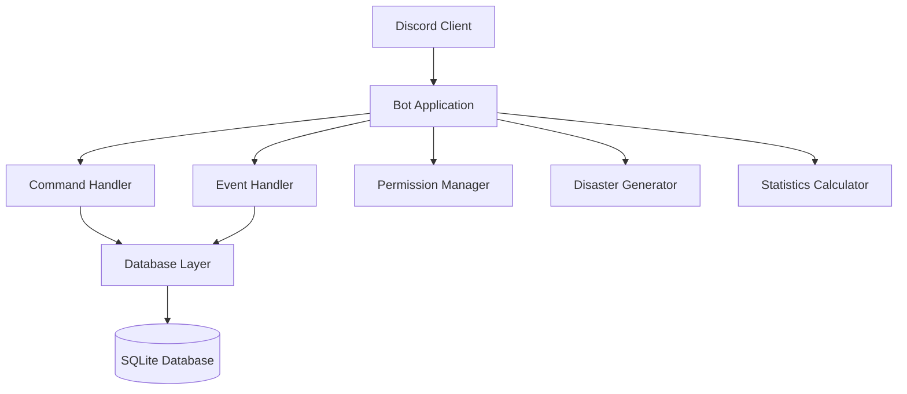

# Design Document

## Overview

The Model US Discord Bot is a comprehensive server management system built using Discord.js v14 with TypeScript, designed to facilitate a Model United States simulation. The bot provides nation statistics management, user activity tracking, disaster simulation, war management, and administrative tools through Discord slash commands.

The system follows a modular architecture with clear separation between command handling, database operations, and business logic. All user interactions occur through Discord's native slash command interface, ensuring type safety and improved user experience.

## Architecture

### High-Level Architecture



### Technology Stack

- **Runtime**: Node.js with TypeScript
- **Discord Library**: Discord.js v14 (latest stable)
- **Database**: SQLite with better-sqlite3 driver
- **Command System**: Discord slash commands with autocomplete
- **Architecture Pattern**: Command pattern with modular handlers

### Key Design Decisions

1. **SQLite Database**: Chosen for simplicity, reliability, and ease of deployment. Supports both bot operations and external manual data entry through database tools.

2. **Slash Commands**: All interactions use Discord's native slash commands for better UX, type safety, and mobile compatibility.

3. **Modular Command Structure**: Each command is a separate module with its own handler, making the codebase maintainable and extensible.

4. **Permission-Based Access Control**: Admin commands are protected by Discord role permissions, with fallback to hardcoded admin user IDs.

## Components and Interfaces

### Core Components

#### 1. Bot Client (`BotClient`)
- Extends Discord.js Client with custom properties
- Manages command collection and database connection
- Handles bot initialization and shutdown

#### 2. Command Handler (`CommandHandler`)
- Registers and manages all slash commands
- Routes interactions to appropriate command modules
- Handles command validation and error responses

#### 3. Database Manager (`DatabaseManager`)
- Manages SQLite database connections and operations
- Provides CRUD operations for all data entities
- Handles database migrations and schema updates

#### 4. Permission Manager (`PermissionManager`)
- Validates admin permissions for protected commands
- Checks Discord roles and fallback admin user IDs
- Provides consistent permission checking across commands

#### 5. Statistics Calculator (`StatsCalculator`)
- Calculates derived statistics (budget from GDP and tax rate)
- Computes percentage changes for GDP and population
- Handles statistical data validation and formatting

#### 6. Disaster Generator (`DisasterGenerator`)
- Generates random disasters based on probability weights
- Creates detailed disaster scenarios with timelines and impacts
- Manages disaster templates and randomization logic

### Command Modules

Each command is implemented as a separate module with the following interface:

```typescript
interface Command {
  data: SlashCommandBuilder;
  execute(interaction: ChatInputCommandInteraction): Promise<void>;
  autocomplete?(interaction: AutocompleteInteraction): Promise<void>;
}
```

#### Admin Commands
- `/admin-stats-update` - Update nation statistics
- `/admin-link-user` - Link Discord users to nations
- `/admin-activity` - Check user activity in channels
- `/admin-disaster` - Generate disaster scenarios
- `/admin-war-add` - Add new wars
- `/admin-war-update` - Update war casualties

#### Player Commands
- `/stats` - View nation statistics
- `/wars` - List all wars
- `/rankings` - View nation rankings by category

## Data Models

### Database Schema

#### Nations Table
```sql
CREATE TABLE nations (
    id INTEGER PRIMARY KEY AUTOINCREMENT,
    name TEXT UNIQUE NOT NULL,
    gdp REAL NOT NULL DEFAULT 0,
    stability REAL NOT NULL DEFAULT 0,
    population INTEGER NOT NULL DEFAULT 0,
    tax_rate REAL NOT NULL DEFAULT 20.0,
    budget REAL GENERATED ALWAYS AS (gdp * tax_rate / 100) STORED,
    previous_gdp REAL,
    previous_population INTEGER,
    gdp_change REAL GENERATED ALWAYS AS (
        CASE 
            WHEN previous_gdp IS NOT NULL AND previous_gdp > 0 
            THEN ((gdp - previous_gdp) / previous_gdp) * 100 
            ELSE NULL 
        END
    ) STORED,
    population_change REAL GENERATED ALWAYS AS (
        CASE 
            WHEN previous_population IS NOT NULL AND previous_population > 0 
            THEN ((population - previous_population) / CAST(previous_population AS REAL)) * 100 
            ELSE NULL 
        END
    ) STORED,
    created_at DATETIME DEFAULT CURRENT_TIMESTAMP,
    updated_at DATETIME DEFAULT CURRENT_TIMESTAMP
);
```

#### User Links Table
```sql
CREATE TABLE user_links (
    id INTEGER PRIMARY KEY AUTOINCREMENT,
    discord_id TEXT UNIQUE NOT NULL,
    nation_name TEXT NOT NULL,
    created_at DATETIME DEFAULT CURRENT_TIMESTAMP,
    FOREIGN KEY (nation_name) REFERENCES nations(name) ON DELETE CASCADE
);
```

#### Wars Table
```sql
CREATE TABLE wars (
    id INTEGER PRIMARY KEY AUTOINCREMENT,
    name TEXT NOT NULL,
    participants TEXT NOT NULL, -- JSON array of nation names
    start_date DATE NOT NULL,
    end_date DATE,
    casualties INTEGER DEFAULT 0,
    description TEXT,
    status TEXT DEFAULT 'active', -- 'active', 'ended'
    created_at DATETIME DEFAULT CURRENT_TIMESTAMP,
    updated_at DATETIME DEFAULT CURRENT_TIMESTAMP
);
```

#### Activity Tracking Table
```sql
CREATE TABLE user_activity (
    id INTEGER PRIMARY KEY AUTOINCREMENT,
    discord_id TEXT NOT NULL,
    channel_id TEXT NOT NULL,
    last_message_at DATETIME NOT NULL,
    message_count INTEGER DEFAULT 1,
    PRIMARY KEY (discord_id, channel_id)
);
```

### Data Transfer Objects

#### NationStats
```typescript
interface NationStats {
    name: string;
    gdp: number;
    stability: number;
    population: number;
    taxRate: number;
    budget: number;
    gdpChange?: number;
    populationChange?: number;
    updatedAt: Date;
}
```

#### War
```typescript
interface War {
    id: number;
    name: string;
    participants: string[];
    startDate: Date;
    endDate?: Date;
    casualties: number;
    description?: string;
    status: 'active' | 'ended';
}
```

#### DisasterEvent
```typescript
interface DisasterEvent {
    type: 'small' | 'medium' | 'large' | 'very_large';
    category: 'natural' | 'pandemic' | 'war' | 'economic' | 'famine';
    title: string;
    description: string;
    timeline: string;
    estimatedCasualties: number;
    economicCost: number;
    affectedRegions: string[];
    proximityFactor?: number; // For war-related disasters
}
```

## Correctness Properties

*A property is a characteristic or behavior that should hold true across all valid executions of a system-essentially, a formal statement about what the system should do. Properties serve as the bridge between human-readable specifications and machine-verifiable correctness guarantees.*

### Property 1: Statistics Persistence
*For any* nation and any valid statistics update, storing the statistics should result in the database containing the exact values that were provided.
**Validates: Requirements 1.1**

### Property 2: Budget Calculation Consistency
*For any* nation with GDP and tax rate values, the budget should always equal GDP multiplied by tax rate divided by 100.
**Validates: Requirements 1.2**

### Property 3: Percentage Change Calculation
*For any* nation with previous GDP or population values, when new values are stored, the percentage change should equal ((new_value - old_value) / old_value) * 100.
**Validates: Requirements 1.5**

### Property 4: External Database Integration
*For any* data manually inserted into the database, the bot commands should reflect and display that data correctly.
**Validates: Requirements 1.4, 9.3**

### Property 5: Complete Statistics Display
*For any* valid nation, the /stats command response should contain all required fields: GDP, Stability, Population, Tax Rate, and Budget.
**Validates: Requirements 2.1**

### Property 6: Percentage Change Display
*For any* nation with previous data, the /stats command should display percentage changes for GDP and Population when available.
**Validates: Requirements 2.2**

### Property 7: Statistics Response Format
*For any* /stats command response, the output should be a valid Discord embed with proper structure and formatting.
**Validates: Requirements 2.4, 10.4**

### Property 8: User-Nation Linking
*For any* valid Discord user ID and nation name, the link command should create or update the association correctly.
**Validates: Requirements 3.1, 3.3**

### Property 9: Link Uniqueness
*For any* nation, only one user should be linked to it at a time unless explicitly overridden.
**Validates: Requirements 3.4**

### Property 10: Activity Data Completeness
*For any* channel and set of users, the activity command should display time since last message for all users who have posted.
**Validates: Requirements 4.1, 4.2**

### Property 11: Channel Parameter Handling
*For any* valid channel ID provided to the activity command, the bot should monitor and report activity for that specific channel.
**Validates: Requirements 4.4**

### Property 12: Disaster Probability Distribution
*For any* large sample of generated disasters, the distribution should approach 50% small, 35% medium, 10% large, and 5% very large disasters.
**Validates: Requirements 5.1**

### Property 13: Disaster Information Completeness
*For any* generated disaster, the response should include timeline, estimated casualties, economic cost, and affected regions.
**Validates: Requirements 5.2**

### Property 14: Disaster Category Variety
*For any* series of disaster generations, the system should be capable of producing disasters from all required categories: natural, pandemic, famine, distant wars, and nearby conflicts.
**Validates: Requirements 5.3**

### Property 15: War Proximity Impact
*For any* war-related disaster, nearby conflicts should have higher severity ratings than distant conflicts.
**Validates: Requirements 5.4**

### Property 16: War Data Persistence
*For any* war record with start date, participants, and casualties, the system should store and retrieve all provided information accurately.
**Validates: Requirements 6.1, 6.3**

### Property 17: War Update Consistency
*For any* existing war record, updating casualties should modify only the casualty field while preserving all other war data.
**Validates: Requirements 6.2**

### Property 18: War Information Display
*For any* war in the system, the display should include start date, casualty count, and participant nations.
**Validates: Requirements 6.4**

### Property 19: Rankings Sort Accuracy
*For any* ranking category and set of nations, the results should be sorted in descending order by the specified metric.
**Validates: Requirements 7.1**

### Property 20: Rankings Category Support
*For any* of the supported categories (Tax Rate, Population, GDP, Stability), the rankings command should successfully generate and display results.
**Validates: Requirements 7.2**

### Property 21: Rankings Format Consistency
*For any* rankings request, the response should follow a consistent leaderboard format with nation names and values.
**Validates: Requirements 7.3**

### Property 22: Admin Access Control
*For any* non-admin user attempting any admin command, the system should deny access and provide an appropriate error message.
**Validates: Requirements 8.1**

### Property 23: Permission Verification Consistency
*For any* administrative function, the system should verify admin permissions before execution.
**Validates: Requirements 8.2**

### Property 24: Administrative Action Logging
*For any* admin command execution, the system should create a log entry for audit purposes.
**Validates: Requirements 8.3**

### Property 25: Permission Update Responsiveness
*For any* change in Discord role permissions, the bot should immediately reflect the new permissions in subsequent command attempts.
**Validates: Requirements 8.4**

### Property 26: Data Persistence Completeness
*For any* data stored in the system (nations, users, wars, activity), the information should remain available after bot restarts.
**Validates: Requirements 9.1, 9.2**

### Property 27: Database Error Handling
*For any* database operation failure, the system should provide clear error messages while maintaining data consistency.
**Validates: Requirements 9.4**

### Property 28: Slash Command Implementation
*For any* user command, it should be implemented as a Discord slash command with proper parameter definitions.
**Validates: Requirements 10.1**

### Property 29: Command Error Feedback
*For any* incorrectly used command, the system should provide helpful usage instructions.
**Validates: Requirements 10.2**

### Property 30: Input Validation Consistency
*For any* command requiring parameters, invalid input should trigger clear error messages with validation details.
**Validates: Requirements 10.5**

## Error Handling

### Database Error Management
- Connection failures: Retry logic with exponential backoff
- Query failures: Transaction rollback and user notification
- Data integrity violations: Prevent corruption and inform users
- Migration errors: Safe rollback to previous schema version

### Discord API Error Handling
- Rate limiting: Automatic retry with proper delays
- Permission errors: Clear user feedback about missing permissions
- Network timeouts: Graceful degradation and retry mechanisms
- Invalid interactions: Proper error responses within Discord's 3-second limit

### Input Validation
- Nation name validation: Alphanumeric with spaces, length limits
- Numeric validation: Range checking for statistics (GDP > 0, stability 0-100)
- User ID validation: Discord snowflake format verification
- Channel ID validation: Existence and bot access verification

### Command-Specific Error Handling
- Non-existent nations: Suggest similar names or creation process
- Permission denied: Clear explanation of required roles
- Missing data: Helpful guidance on data entry methods
- Concurrent modifications: Optimistic locking with retry suggestions

## Testing Strategy

### Dual Testing Approach
The testing strategy employs both unit tests and property-based tests to ensure comprehensive coverage:

- **Unit tests**: Verify specific examples, edge cases, and error conditions
- **Property tests**: Verify universal properties across all inputs using randomized data
- Both approaches are complementary and necessary for complete validation

### Property-Based Testing Configuration
- **Framework**: fast-check for TypeScript/JavaScript property-based testing
- **Test iterations**: Minimum 100 iterations per property test to ensure thorough coverage
- **Test tagging**: Each property test references its corresponding design property
- **Tag format**: `// Feature: model-us-discord-bot, Property {number}: {property_text}`

### Unit Testing Focus Areas
- **Specific examples**: Concrete test cases that demonstrate correct behavior
- **Edge cases**: Empty inputs, boundary values, invalid data scenarios
- **Integration points**: Database connections, Discord API interactions
- **Error conditions**: Network failures, permission denials, data conflicts

### Property Testing Focus Areas
- **Universal properties**: Mathematical relationships, data consistency rules
- **Randomized input coverage**: Generate diverse test data automatically
- **Invariant verification**: Properties that must hold regardless of input
- **State consistency**: Ensure system state remains valid across operations

### Test Organization
- **Command tests**: Each slash command has dedicated test suites
- **Database tests**: Data layer operations with in-memory SQLite
- **Permission tests**: Access control verification across user roles
- **Integration tests**: End-to-end command execution with mocked Discord interactions

### Continuous Integration
- **Automated testing**: All tests run on code changes
- **Coverage requirements**: Minimum 80% code coverage for core functionality
- **Performance benchmarks**: Response time validation for critical commands
- **Database migration testing**: Schema changes validated against existing data